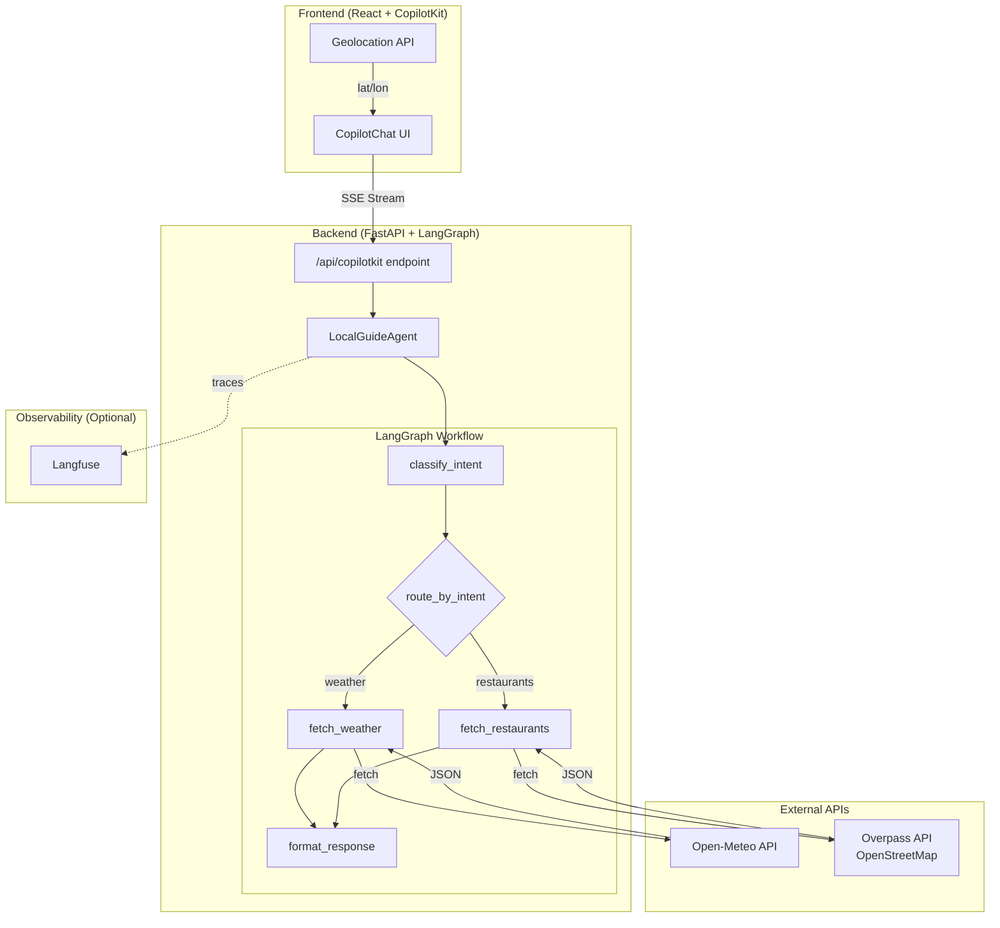
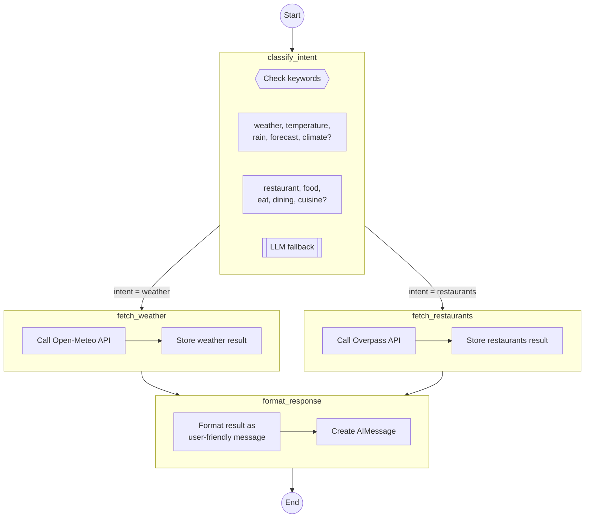

# Local Guide (CopilotKit + LangGraph)

A local guide app that uses a CopilotKit UI with a Python LangGraph backend to provide weather information and nearby restaurant recommendations based on user location.

## Features

- Real-time weather via Open-Meteo (no API key needed)
- Nearby restaurants via OpenStreetMap/Overpass (no API key needed)
- Browser geolocation integration
- LangGraph-powered intent classification and tool routing
- Optional Langfuse tracing for observability
- Configurable OpenAI model (default: `gpt-4o-mini`)

## Architecture

- Frontend: Vite + React + TypeScript + CopilotKit UI
- Backend: FastAPI + LangGraph + LangChain
- Package managers: UV (Python), npm (JavaScript)
- Observability: Langfuse (optional, local or cloud)

### System Architecture Diagram



### LangGraph Agent Workflow



**Workflow Steps:**

1. **START** → Entry point
2. **classify_intent** → Determines user intent via keyword matching or LLM
3. **Conditional Edge** → Routes based on `intent` value:
   - `"weather"` → `fetch_weather` node
   - `"restaurants"` → `fetch_restaurants` node
4. **fetch_weather** / **fetch_restaurants** → Calls respective external API
5. **format_response** → Transforms API response into user-friendly message
6. **END** → Returns final AIMessage

## Agent Logic Details

### 1. Intent Classification (`classify_intent`)

The agent first determines what the user is asking for using a two-tier approach:

| Step | Method | Keywords | Fallback |
|------|--------|----------|----------|
| 1 | Keyword matching | `weather`, `temperature`, `rain`, `forecast`, `climate` → **weather** | - |
| 2 | Keyword matching | `restaurant`, `food`, `eat`, `dining`, `cuisine` → **restaurants** | - |
| 3 | LLM classification | If no keywords match, ask LLM to classify | Defaults to **weather** |

### 2. Conditional Routing (`_route_by_intent`)

After classification, a conditional edge routes to the appropriate node:

```python
# Routing function
def _route_by_intent(state: AgentState) -> str:
    intent = state.get("intent", "weather")
    return intent  # "weather" or "restaurants"
```

### 3. Tool Nodes

Each intent has a dedicated node that calls its respective API:

| Node | API | Endpoint |
|------|-----|----------|
| `fetch_weather` | Open-Meteo | `https://api.open-meteo.com/v1/forecast` |
| `fetch_restaurants` | Overpass (OSM) | `https://overpass-api.de/api/interpreter` |

**Weather API Response:**

```json
{
  "temperature": 22.5,
  "feels_like": 21.0,
  "conditions": "Partly cloudy",
  "humidity": 65,
  "wind_speed": 12.5
}
```

**Restaurants API Response:**

```json
[
  {
    "name": "Restaurant Name",
    "cuisine": "Italian",
    "address": "123 Main St"
  }
]
```

### 4. Response Formatting (`format_response`)

The raw API response is transformed into a user-friendly message:

| Intent | Format |
|--------|--------|
| `weather` | 🌡️ Temperature, feels-like, conditions, humidity, wind speed |
| `restaurants` | 🍽️ Numbered list with name, cuisine, and address (up to 10 results) |
| `error` | Error message with details |

### Data Flow Summary

```
User Message + Location
        │
        ▼
  ┌─────────────┐
  │classify_intent│
  └──────┬──────┘
         │
    ┌────┴────┐
    ▼         ▼
┌───────┐ ┌────────────┐
│weather│ │restaurants │  ← Conditional Edge
└───┬───┘ └─────┬──────┘
    │           │
    └─────┬─────┘
          ▼
  ┌─────────────┐
  │format_response│
  └──────┬──────┘
         ▼
   AIMessage (SSE)
```

## Quick Start

### 1) Backend

```bash
cd backend
cp .env.example .env
# Add OPENAI_API_KEY in backend/.env
uv sync
uv run uvicorn src.main:app --reload --port 8000
```

Backend entry point is `backend/src/main.py` (run via `uvicorn src.main:app`).

### 2) Frontend

```bash
cd frontend
npm install
npm run dev
```

### 3) (Optional) Langfuse

Langfuse provides observability and tracing for your AI agent. Start it with Docker Compose:

```bash
docker-compose -f docker-compose.langfuse.yml up -d
```

Wait about 10 seconds for all services to start, then access the UI:
- **Langfuse UI**: http://localhost:3000

#### Initial Setup & Creating API Keys

1. **First Time - Create Your Account**
   - Navigate to http://localhost:3000/auth/sign-up
   - Create an account with your email and password
   - Sign in at http://localhost:3000/auth/sign-in

2. **Create a Project**
   - After signing in, you'll be prompted to create a project (or one may be created automatically)
   - Give it a name (e.g., "Local Guide")

3. **Generate API Keys**
   - Once in your project, click on **Settings** in the left sidebar
   - Navigate to **API Keys**
   - Click **Create new API keys**
   - You'll see two keys:
     - **Public Key** (starts with `pk-lf-`)
     - **Secret Key** (starts with `sk-lf-`)
   - **Important**: Copy both keys immediately - the secret key won't be shown again!

4. **Add Keys to Backend .env**
   
   Open `backend/.env` and add these lines:
   ```bash
   # Langfuse Configuration
   LANGFUSE_SECRET_KEY=sk-lf-your-secret-key-here
   LANGFUSE_PUBLIC_KEY=pk-lf-your-public-key-here
   LANGFUSE_HOST=http://localhost:3000
   ```

5. **Restart Backend**
   ```bash
   # Stop the backend (Ctrl+C), then restart:
   cd backend
   uv run uvicorn src.main:app --reload --port 8000
   ```

6. **Verify Tracing**
   - Use your app (ask weather or restaurant questions)
   - Go to http://localhost:3000
   - Click on **Traces** - you should see your agent's activity!
   - Each trace shows:
     - **Name**: "Local Guide: [your question]..."
     - **Input**: Your message with location coordinates
     - **Output**: The agent's formatted response
     - Click on any trace to see detailed execution steps


#### Langfuse Architecture

The production-ready setup includes:
- **PostgreSQL** - Main database
- **ClickHouse** - Analytics database for performance
- **Redis** - Caching and queue management
- **MinIO** - S3-compatible storage (accessible at http://localhost:9090)
- **Langfuse Web** - Main UI (port 3000)
- **Langfuse Worker** - Background job processor


## Usage

1. Open `http://localhost:5173`
2. Allow location access
3. Ask questions like:
   - "What's the weather like?"
   - "Show me restaurants nearby"
   - "Find Italian restaurants"

## Configuration

### Backend (.env)

```bash
# Required
OPENAI_API_KEY=sk-...

# Optional
OPENAI_MODEL=gpt-4o-mini
LANGFUSE_SECRET_KEY=sk-lf-...
LANGFUSE_PUBLIC_KEY=pk-lf-...
LANGFUSE_HOST=http://localhost:3000
PORT=8000
FRONTEND_URL=http://localhost:5173
```

### Model choices

- `gpt-4o-mini` (default, cost-effective)
- `gpt-4o` (higher quality)
- `gpt-4-turbo`
- `gpt-3.5-turbo` (budget)

Example:
```bash
OPENAI_MODEL=gpt-4o
```

## API Endpoints

### CopilotKit runtime

- `POST /api/copilotkit` (SSE)
- `GET /health`
- `GET /docs` (Swagger UI)

Test the runtime endpoint:
```bash
curl -X POST http://localhost:8000/api/copilotkit \
  -H "Content-Type: application/json" \
  -d '{
    "messages": [{"role": "user", "content": "What is the weather?"}],
    "forwardedProps": {
      "location": {"latitude": 37.7749, "longitude": -122.4194}
    }
  }'
```

## CopilotKit Runtime Notes

- The frontend calls `http://localhost:8000/api/copilotkit`
- The backend streams AG-UI events over SSE:
  - `RUN_STARTED`, `TEXT_MESSAGE_START`, `TEXT_MESSAGE_CONTENT`, `TEXT_MESSAGE_END`, `RUN_FINISHED`

## Development

### Project structure

```
backend/
├── src/
│   ├── main.py          # FastAPI app & routes
│   ├── agent.py         # LangGraph agent workflow
│   ├── tools.py         # Weather & restaurant tools
│   └── logger.py        # Structured logging
├── pyproject.toml
└── .env

frontend/
├── src/
│   ├── App.tsx
│   ├── App.css
│   └── main.tsx
└── package.json
```

### Adding a new intent

1. Add a tool in `backend/src/tools.py`
2. Add an @tool wrapper in `backend/src/agent.py`
3. Update intent classification logic
4. Add response formatting in `_format_response`

### Customizing the UI

Edit `frontend/src/App.tsx` and `frontend/src/App.css`.

## Troubleshooting

- **Backend not starting**: confirm `OPENAI_API_KEY` in `backend/.env`, then `uv sync`
- **Frontend cannot connect**: ensure backend is on port 8000 and CORS allows `http://localhost:5173`
- **Location not available**: allow browser location permission; use `http://localhost:5173`
- **CopilotKit UI not loading**: reinstall frontend deps (`npm install`)
- **No restaurants**: Overpass can be slow; try a different location or try again
- **Langfuse warnings**: safe to ignore if you are not using tracing

## Resources

- CopilotKit docs: https://docs.copilotkit.ai
- LangGraph docs: https://langchain-ai.github.io/langgraph/
- FastAPI docs: https://fastapi.tiangolo.com/
- Open-Meteo API: https://open-meteo.com/en/docs
- Overpass API: https://wiki.openstreetmap.org/wiki/Overpass_API

## License

MIT
